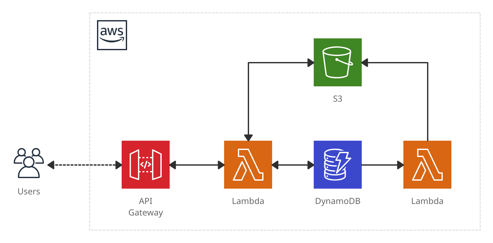

# Pickle

Extend the shelf life of PageSpeed Insights reports 🥒

## Architecture



## Deployments

You will need an S3 bucket to store deployment artifacts. You can create one with:

```sh
aws s3 mb s3://{bucket_name}
```

Then use that bucket name to deploy with:

```sh
ARTIFACT_BUCKET={bucket_name} ./scripts/deploy.sh
```

## Licence

[MIT](./LICENSE)
